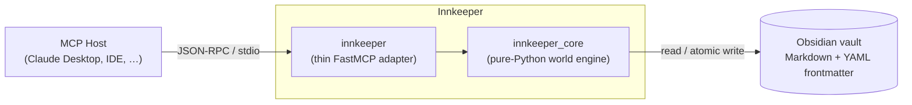

# Innkeeper

[](https://github.com/jim-jam-james/innkeeper/actions/workflows/ci.yml)

**A schema-driven [Model Context Protocol](https://modelcontextprotocol.io) (MCP) server that turns an Obsidian vault into a queryable, self-validating worldbuilding database** — for TTRPGs (D&D), game settings, and novels.

Point your MCP host (Claude Desktop, an IDE, any MCP client) at a vault, and Innkeeper gives the model a typed, validated view of your world: it can create characters and factions, wire up *typed* relationships with automatically-maintained inverses, run structural consistency checks, and generate new content that respects the structure that's already there.

The guiding split: **the server verifies, the model creates.** Innkeeper never calls an LLM — it exposes a clean, safe surface of tools, resources, and prompts, and lets the host's model do the reasoning.

---

## How it fits together



The model in the host does all reasoning. Innkeeper is the *typed hands* it reaches into your vault with.

---

## Quickstart

Innkeeper runs from source today (PyPI publish is on the roadmap). You'll need [`uv`](https://docs.astral.sh/uv/).

```bash
git clone https://github.com/jim-jam-james/innkeeper.git
cd innkeeper
uv sync
uv run pytest -q     # optional: 70 tests should pass
```

**Initialize a vault** — writes a hidden `.innkeeper/schema.yaml` and the type folders. It's non-destructive: it refuses to clobber an existing vault.

```bash
uv run innkeeper init --vault /path/to/your/vault
```

Then wire the server into your host (below) and start building.

---

## Connecting a host

Innkeeper speaks stdio and takes its vault path from the `OBSIDIAN_VAULT_PATH` environment variable. Add it to your host's MCP config. For **Claude Desktop** (`claude_desktop_config.json`):

```json
{
  "mcpServers": {
    "innkeeper": {
      "command": "uv",
      "args": ["--directory", "/absolute/path/to/innkeeper", "run", "innkeeper"],
      "env": {
        "OBSIDIAN_VAULT_PATH": "/absolute/path/to/your/vault"
      }
    }
  }
}
```

> **Windows / Microsoft Store build note:** use an absolute path to `uv` (e.g. `C:/Users/<you>/.local/bin/uv.exe`), since the sandboxed host's `PATH` may not include it. The config also lives under `%LOCALAPPDATA%\Packages\Claude_*\LocalCache\Roaming\Claude\`, and closing the window only minimizes to the tray — right-click the tray icon → **Quit** to actually reload the config.

Restart the host. Innkeeper's tools, resources, and prompts will appear.

---

## Core concepts

**Schema is the single source of truth.** One YAML file per vault (`.innkeeper/schema.yaml`) defines every entity *type*, its fields, and its *typed relationships*. Validation, generation, and querying all read from it — there's no structure hard-coded in the server. Edit the schema, and the whole system follows. The default ships a lean **core-6**: `Character`, `Faction`, `Location`, `Event`, `Item`, `Lore`.

**Two-tier links.** Innkeeper distinguishes *typed* relationships (a `member_of:` property in frontmatter — validated, graph-native, and the server **auto-maintains the inverse** `members:` on the other side) from plain prose `[[mentions]]` in the body (soft associations, left alone). You get machine-checkable structure without losing free-form writing.

**Hybrid identity.** Notes link each other by human-readable **title** (`[[Aldric]]`, graph-native in Obsidian), but every entity also carries a stable `uid` (`char_aldric_a1b2`) that the server uses as its real primary key. Renames, duplicate names, and external edits don't break the graph — the index is rebuilt from a full scan and anchored on `uid`.

**Non-destructive by default.** `delete_entity` soft-deletes to `_trash/`. `purge=true` is the only destructive path, and even then it strips *typed* links (with a report of every note it touched) while leaving human prose mentions intact for `validate` to flag. Writes are atomic (write-then-rename).

**Server verifies, model creates.** Innkeeper never generates prose itself. `validate` catches structural problems (dangling links, wrong target types, cardinality violations, missing inverses) and can mechanically `fix` the unambiguous ones — but semantic judgment is always handed back to the host's model.

---

## Architecture — ports & adapters

Innkeeper is built as a **standalone domain core with a thin protocol adapter bolted on last**:

- **`innkeeper_core`** — pure Python. Entities, schema, the vault index, CRUD, typed linking, validation, query. It has **no idea MCP exists** and never imports it. Fully unit-tested against temp-vault fixtures.
- **`innkeeper`** — the FastMCP adapter. Every tool is a near-trivial wrapper: call a core function, wrap the result in a `{"ok": bool, …}` envelope. No business logic lives here.

The dependency graph is a strict one-way DAG:

```
models → schema → vault → index → entities → validate
                                       ↓
                              innkeeper (adapter)
```

This is the design's main talking point: the core is reusable and testable in isolation, the protocol layer is disposable, and swapping transports (or reusing the engine for something non-MCP) touches nothing in `innkeeper_core`.

---

## Surface reference

### Tools (model-controlled actions)

| Tool | Signature | What it does |
|------|-----------|--------------|
| `create_entity` | `type, name, fields?, body?` | Mint a new entity (unique `uid`, no clobber). |
| `get_entity` | `ref` | Full view: frontmatter, body, resolved one-hop relationships + backlinks. |
| `update_entity` | `ref, fields?, body?, append_body?` | Patch frontmatter and/or replace or append the body. |
| `rename_entity` | `ref, new_name` | Move the note and repair every inbound wikilink across the vault. |
| `delete_entity` | `ref, purge?` | Soft-delete to `_trash/`; `purge=true` strips typed refs and reports touched notes. |
| `link` | `source_ref, rel_name, target_ref` | Create a typed relationship; writes the inverse; auto-stubs a missing target. |
| `unlink` | `source_ref, rel_name, target_ref` | Remove a relationship from both sides. |
| `query_entities` | `type?, fields?, tag?` | Structured filter over type / exact field values / tag. |
| `search` | `query` | Case-insensitive substring search over names and bodies. |
| `validate` | `fix?, scope?` | Structural consistency report; `fix=true` mechanically repairs unambiguous issues. |

### Resources (app-controlled, read-only)

| URI | Contents |
|-----|----------|
| `innkeeper://schema` | The active vault schema (YAML). |
| `innkeeper://types` | The list of defined entity type names. |
| `innkeeper://summary` | Entity counts — total and by type. |

### Prompts (user-controlled templates)

| Prompt | Argument | Embeds |
|--------|----------|--------|
| `flesh_out_entity` | `ref` | The entity's current state + its type's relationship slots. |
| `suggest_connections` | `ref` | The entity + a roster of other entities + valid relationship types. |
| `consistency_review` | `scope?` | Live `validate` findings, for narrative (not just mechanical) fixes. |
| `brainstorm` | `type` | The type's schema + world counts, to fill gaps. |

Every prompt is rendered **server-side** with live world context injected — that's what makes generation graph-aware rather than blank-page.

---

## Development

The full gate (what CI runs):

```bash
uv run ruff check .
uv run ruff format --check .
uv run mypy
uv run pytest -q
```

`innkeeper_core` is fully type-hinted under `mypy --strict`. Coverage lives in the core; the in-memory MCP round-trip tests prove each tool/resource/prompt registers and round-trips.

---

## Roadmap

- [x] Phases 0–7 — schema, vault engine, CRUD, typed relationships, validate + query, MCP adapter (tools + resources + prompts).
- [ ] Phase 8 — docs, example vault, `v1.0.0`.
- [ ] PyPI publish (`uvx innkeeper --vault /path`).
- [ ] Phase 2 (post-1.0) — history / timeline simulation (schema seams already reserved).

See [`PROJECT_PLAN.md`](./PROJECT_PLAN.md) for the full design record and rationale.

---

## License

MIT
